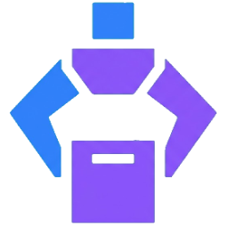
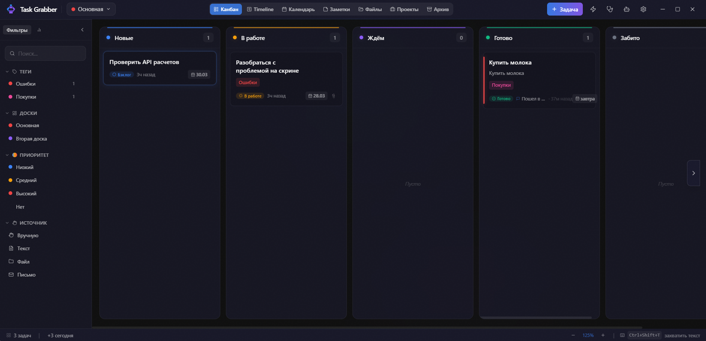
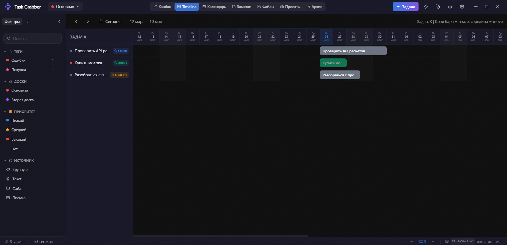
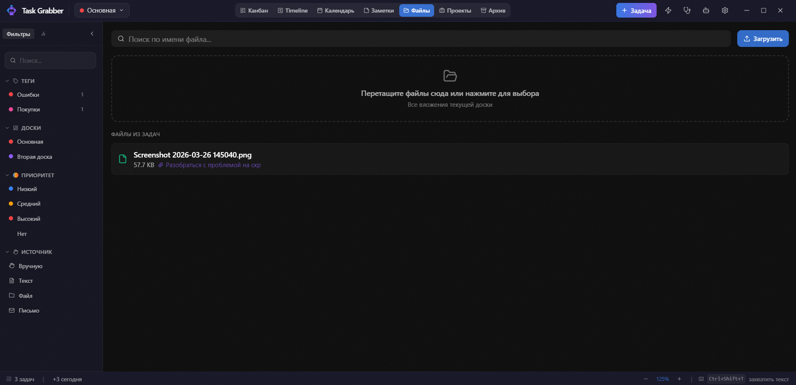

<p align="center">
  
</p>

<h1 align="center">Task Grabber</h1>

<p align="center">
  <b>Хватай всё. Контролируй всё.</b><br>
  Кроссплатформенный менеджер задач с канбан-досками, таймлайном, календарём, фокус-режимом и AI-ассистентом.
</p>

<p align="center">
  
  
  
  
  
</p>

---

## Скриншоты

<p align="center">
  
  <br><em>Канбан-доска с колонками, тегами и статусами</em>
</p>

<p align="center">
  
  <br><em>Timeline — Gantt-шкала с drag-resize</em>
</p>

<p align="center">
  
  <br><em>Файловый менеджер доски</em>
</p>

---

## Что это?

Task Grabber — десктопное приложение, которое живёт в системном трее и позволяет захватывать задачи откуда угодно — выделенный текст, файлы, письма Outlook (.msg) — одним хоткеем. Все задачи попадают на канбан-доску с drag-and-drop, несколькими видами отображения и без единого обязательного поля.

Сделано для скорости. Без аккаунтов, без облака, без лишней фигни. Данные хранятся локально в SQLite.

## Возможности

### Ядро
- **Канбан-доска** — настраиваемые колонки, цвета, WIP-лимиты, drag-and-drop
- **Несколько досок** — отдельные доски для разных проектов
- **Таймлайн** — горизонтальная Gantt-шкала, drag за края бара = resize, за середину = move
- **Календарь** — месячная сетка, задачи в ячейках дат
- **Апдейты задач** — лента активности, быстрый апдейт через ПКМ
- **Статусы** — визуальные бейджи статуса задачи во всех видах
- **Архив** — отдельный вид с сеткой карточек, ПКМ → восстановить на доску
- **Масштаб колонок** — ×1 / ×1.5 / ×2 в настройках (для ноутбуков и больших мониторов)

### Захват
- **Глобальные хоткеи** — выделенный текст (`Ctrl+Shift+T`), файлы (`Ctrl+Shift+F`), скриншоты (`Ctrl+Shift+S`)
- **Outlook интеграция** — перетащи .msg файл → задача из письма
- **Быстрый захват** — двойное нажатие хоткея = задача без диалога
- **Drop zone** — перетаскивай файлы/письма на доску

### Продуктивность
- **Фокус-режим** — Pomodoro таймер в отдельном always-on-top окне
- **Десктоп виджет** — плавающий виджет с приоритетными задачами
- **Умные правила** — движок автоматизации (ЕСЛИ триггер → ТО действие)
- **AI-ассистент** — OpenRouter / Ollama для анализа и описания задач
- **Task Doctor** — визард аудита: находит проблемы в задачах (просроченные, без дедлайна, заброшенные чеклисты). Пропускает завершённые задачи.

### Организация
- **Теги** с цветами, удаление из фильтров, ПКМ для смены цвета
- **Приоритеты** (настраиваемые цвета)
- **Дедлайны и напоминания** с нативными уведомлениями
- **Повторяющиеся задачи** — ежедневно, еженедельно, ежемесячно, по будням, кастом
- **Связанные задачи** — связи между задачами
- **Вложения** с превью
- **Проекты** — карточки проектов с метаданными (РП, архитектор, ссылки)
- **Markdown описания** с кликабельными чеклистами и тулбаром форматирования

### Поиск и фильтры
- **Глобальный поиск** (`Ctrl+Space`) — по задачам, заметкам, доскам
- **Палитра команд** (`Ctrl+K`) — быстрые действия, навигация
- **Фильтры в сайдбаре** — по тегам, приоритету, источнику, доске
- **Массовые операции** — выбрать несколько задач, переместить/архивировать/удалить

### Заметки
- **Быстрая заметка** (`Ctrl+Shift+N`) — мгновенный захват мыслей
- **Канвас заметок** — сетка карточек с Markdown и поиском
- **Теги на заметках** — те же теги что и на задачах
- **Обрезка длинных заметок** — карточки до 8-9 строк, «Показать всё / Свернуть»
- **Конвертация в задачу** — заметку можно превратить в задачу

## Стек

| Слой | Технология |
|------|-----------|
| Runtime | Electron 33 |
| Frontend | React 18 + TypeScript 5 |
| State | Zustand |
| UI | Tailwind CSS 3 |
| Drag & Drop | @dnd-kit |
| БД | SQLite (better-sqlite3) |
| Иконки | Lucide React |
| Сборка | Vite 5 + electron-builder |
| CI/CD | GitHub Actions |

## Установка

### Скачать

Перейди в [Releases](../../releases/latest) и скачай:

| Платформа | Файл |
|-----------|------|
| Windows | `Task.Grabber.Setup.x.x.x.exe` |
| macOS (Intel) | `Task.Grabber-x.x.x.dmg` |
| macOS (Apple Silicon) | `Task.Grabber-x.x.x-arm64.dmg` |
| Linux | `Task.Grabber-x.x.x.AppImage` |
| ALT Linux / Fedora | `task-grabber-x.x.x.x86_64.rpm` |

### Собрать из исходников

```bash
git clone https://github.com/neuromanser89/task_grabber.git
cd task_grabber
npm install
npx electron-rebuild -f -w better-sqlite3
npm run build
npx electron-builder          # под твою платформу
```

## Разработка

```bash
npm run dev     # Electron + Vite dev server (порт 6173)
npm run build   # tsc (main) + vite build (renderer)
npm run pack    # build + electron-builder → release/
```

Архитектура: 3 окна Electron (основное, виджет, фокус), каждое со своим HTML entry point. Main process — SQLite, хоткеи, трей, автоматизация. Renderer — React + Zustand + Tailwind.

## Хоткеи

| Хоткей | Действие |
|--------|----------|
| `Ctrl+Shift+T` | Текст из буфера → новая задача |
| `Ctrl+Shift+T` ×2 | Быстрый захват (без диалога) |
| `Ctrl+Shift+F` | Файлы из буфера → новая задача |
| `Ctrl+Shift+N` | Быстрая заметка |
| `Ctrl+Shift+W` | Показать/скрыть виджет |
| `Ctrl+Shift+F2` | Показать/скрыть фокус-режим |
| `Ctrl+Shift+S` | Скриншот → новая задача |
| `Ctrl+K` | Палитра команд |
| `Ctrl+Space` | Глобальный поиск |

Все хоткеи захвата настраиваются в Настройках.

## Лицензия

MIT
